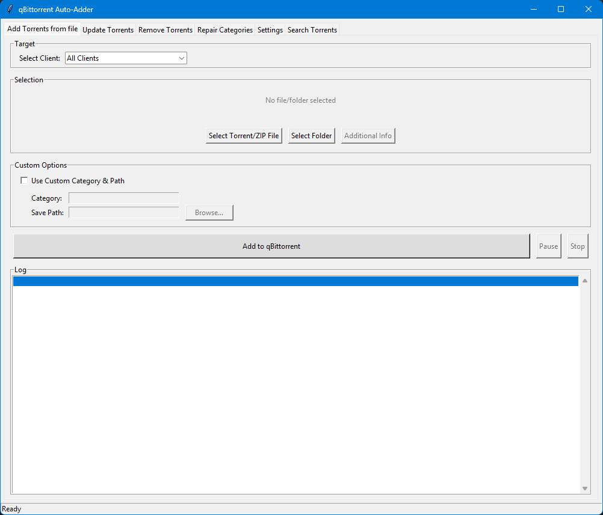

# qBit Adder Python

A powerful GUI tool to manage and automate torrent operations with qBittorrent and Rutracker integration.

## Key Features

### 1. **Update Torrents**
- **Scan & Update**: Automatically compares your current qBittorrent list with Rutracker to find updated torrents (e.g., v2 repacks, added episodes).
- **Tracker Status Check**: Identifies torrents that are "not registered" on the tracker.
- **Actions**:
    - **Re-add (Keep Data)**: Updates the torrent file while preserving downloaded data (forces recheck).
    - **Re-add (Redownload)**: Deletes old data and starts fresh.
    - **Hash Handling**: Detects hash changes and handles migration.

### 2. **Add Torrents**
- **Bulk Add**: Select multiple `.torrent` files or drag-and-drop.
- **Category Management**: automatically fetches and caches categories from Rutracker.
- **Auto-Path**: Suggests save paths based on selected categories.

### 3. **Search Rutracker**
- **In-App Search**: Search Rutracker by name or Topic ID/Hash directly within the app.
- **One-Click Download**: Download `.torrent` files to a temporary folder or add them directly to qBittorrent.

### 4. **Remove Torrents**
- **Bulk Removal**: Select and remove multiple torrents from qBittorrent.
- **Advanced Filters**: Filter list by name.
- **Sortable Columns**: Sort by Name, Size, Category, State, or Save Path.
- **Match from Files**: Select local `.torrent` files to automatically find and select their corresponding entries in the list (calculates Info Hash).
- **Delete Data Option**: Choose whether to delete content files or just remove the torrent entry.

### 5. **Repair / Path Fixer**
- **Category Sync**: Scans for torrents that are in the wrong save path for their category.
- **Auto-Move**: Moves data files to the correct category folder and updates the save path in qBittorrent.

### 6. **Integration & Settings**
- **Multiple Clients**: Manage multiple qBittorrent instances.
- **Auth Management**: Centralized login for Rutracker (with cookie/key extraction).
- **Auto-Updates**:
    - **App Updates**: Checks GitHub for new releases on startup.
    - **List Updates**: Auto-refresh torrent lists.

## Requirements
- Python 3.8+
- qBittorrent (with Web UI enabled)
- Rutracker account (for searching/downloading)

## Screenshots

*The Main Interface showing the Add Tab.*

## User Manual

### 1. Initial Setup
1.  **Launch** the application (`qbit_gui.pyw`).
2.  Go to the **Settings** tab.
3.  **Clients Config**:
    *   Enter your qBittorrent Web UI URL (e.g., `http://localhost:8080`).
    *   Enter username/password if authentication is enabled.
    *   Set the "Base Save Path" (default download location).
4.  **Rutracker Auth**:
    *   Enter your Rutracker username and password.
    *   Click "Save Rutracker Settings".
5.  **Restart** the app to ensure all settings are loaded correctly.

### 2. Updating Torrents
1.  Go to the **Update** tab.
2.  Select your client from the dropdown.
3.  Click **"Scan for Updates"**.
4.  The app will compare your qBittorrent list with Rutracker.
5.  **Review the list**:
    *   **New**: A newer version of the torrent (e.g., updated distribution) is available.
    *   **Action**: Select the torrent and choose "Update (Keep Data)" or "Update (Delete Old)".

### 3. Searching & Downloading
1.  Go to the **Search** tab.
2.  **Search by Name**: Enter a query (e.g., "Matrix 1999") and press Enter or click "Search".
    *   Double-click a result to download the `.torrent` file.
3.  **Search by Hash/ID**: Enter a Topic ID or Hash tag to find a specific release.
4.  **Download Actions**:
    *   **Download**: Saves the `.torrent` file to the `temp_torrents` folder.
    *   **Download & Add**: Downloads and immediately opens the "Add New" tab with the file pre-selected.

### 4. Removing Torrents
1.  Go to the **Remove Torrents** tab.
2.  Click **"Refresh List"** to load current torrents.
3.  **Filter**: Type in the filter box to find torrents by name.
4.  **Sorting**: Click column headers (Name, Size, Path) to sort.
5.  **Select from Files**: Click "Select from .torrent files..." to choose local `.torrent` files. The app will highlight the corresponding torrents in the list (matching by hash).
6.  **Delete**: Select items and click "Remove Selected Torrents".
    *   Check **"Also delete content files"** to permanently delete the data from disk.

### 5. Settings & Updates
- **Check for Updates**: In the Settings tab, click "Check for updates" to see if a new version of the app is available on GitHub.
- **Auto-Update**: Enable "Auto-update list" to keep the torrent list fresh when switching tabs.

